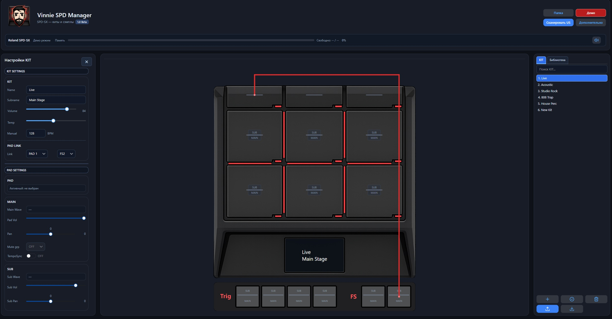

# Vinnie SPD Manager

Репозиторий содержит **только релизные бинарные сборки** для Windows (без исходного кода).

## Скачать

- **Vinnie SPD Manager Installer.exe** (рекомендуется): установка в систему с ярлыками и деинсталлятором.
- **Portable.zip**: запуск без установки (`VinnieSpdManager.exe` + папка `DATA`).

Скачивание: [Releases](https://github.com/vinnienasta1/Vinnie_SPD_Manager/releases)

## О программе

**Vinnie SPD Manager** — приложение для Roland SPD-SX под Windows:

- создание и настройка китов;
- импорт и экспорт данных SPD-SX;
- библиотека сэмплов;
- встроенный конвертер WAW;
- генератор клик-трека;
- резервное копирование проекта.

## Быстрый старт

### Вариант 1: Vinnie SPD Manager Installer.exe

1. Скачай `Install.exe` из раздела Releases.
2. Запусти установщик.
3. Открой **Vinnie SPD Manager** из меню Пуск.

### Вариант 2: Portable.zip

1. Скачай `Portable.zip`.
2. Распакуй архив в любую папку.
3. Запусти `VinnieSpdManager.exe`.

## Системные требования

- ОС: **Windows 10/11 x64**.
- Интернет нужен только для проверки и скачивания обновлений.

## Где хранятся данные

- Настройки, логи и рабочие файлы:
  - `%LocalAppData%\\VinnieSpdManager`

## Поддержка проекта

Если программа полезна, можешь поддержать разработку через QR в окне **О программе**.

## Контакты

Telegram: [@vinnienasta1](https://t.me/vinnienasta1)

---

© Vinnie SPD Manager

